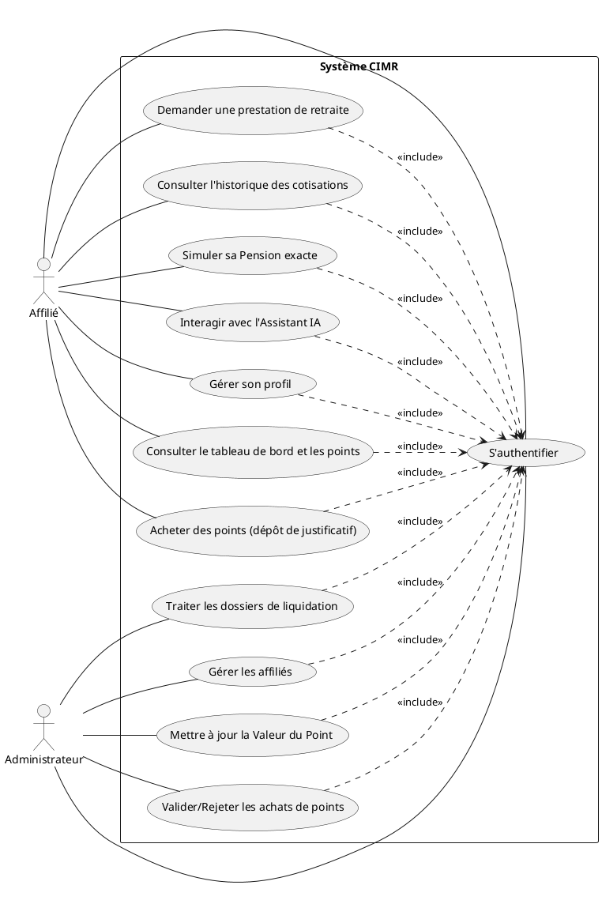
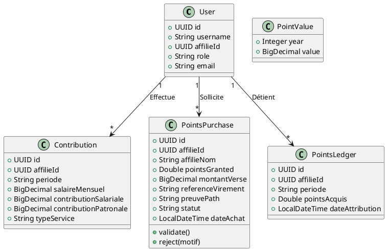
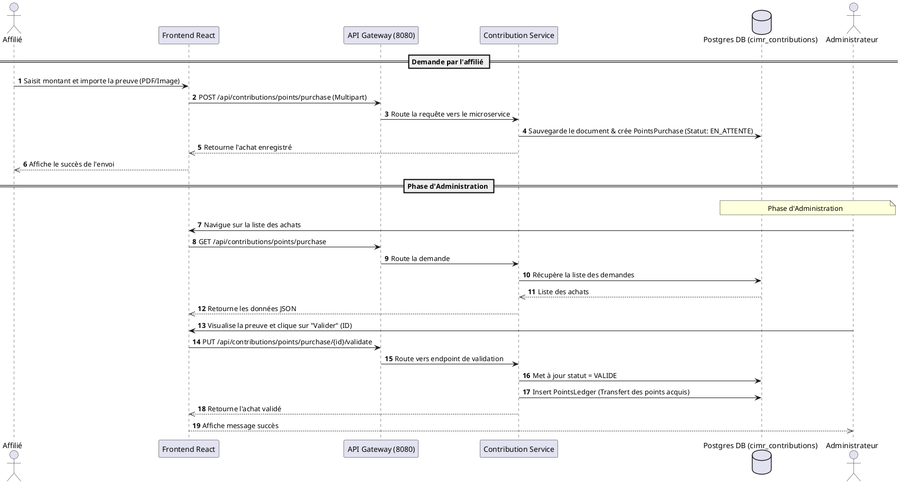

# Diagrammes UML pour le Projet CIMR

Voici les diagrammes représentant l'architecture globale, les données et les interactions de votre système de gestion CIMR. Ils sont générés avec la syntaxe PlantUML.

## 1. Diagramme de Cas d'Utilisation

*Ce diagramme illustre les principales interactions entre les acteurs (Affilié et Administrateur) et le système.*

---

## 2. Diagramme de Classes (Modèle de Domaine Simplifié)

*Ce diagramme représente les entités métiers principales liées aux cotisations et à l'acquisition de points, correspondant à ce que nous avons configuré dans le backend.*

---

## 3. Diagramme de Séquence (Achat et Validation de Points)

*Ce diagramme retrace le flux étape par étape lorsqu'un Affilié décide d'acheter des points supplémentaires via un virement bancaire, jusqu'à l'approbation de l'Administrateur.*

