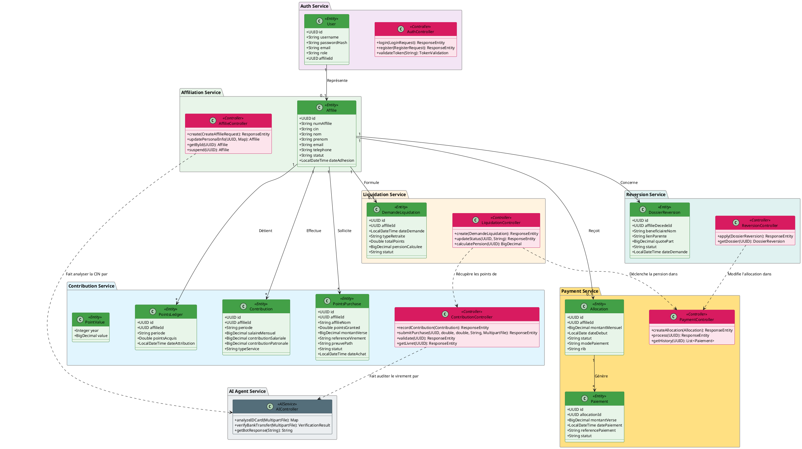

# Diagramme de Classes Global & Détaillé — Projet CIMR

Ce document contient le code source PlantUML pour le diagramme de classes global de votre application microservices. Ce diagramme intègre à la fois les contrôleurs REST et les entités du domaine métier de chaque service, ainsi que leurs relations.

---

## Code Source PlantUML

