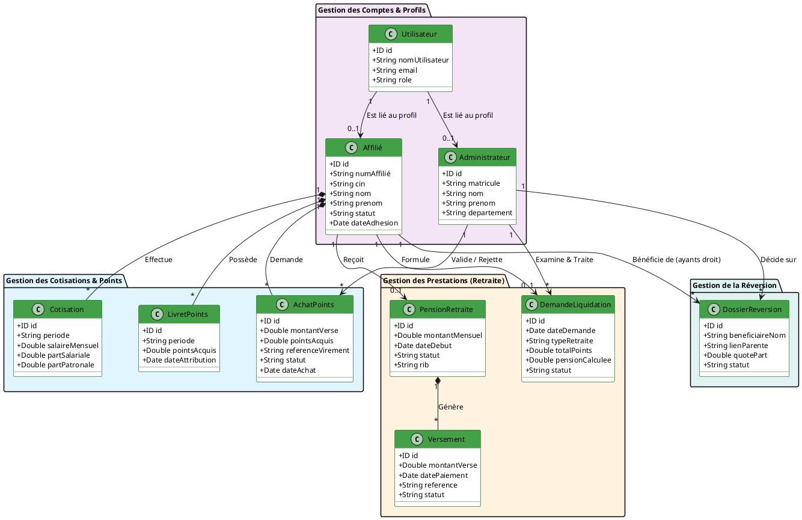

# Diagramme de Classes Simplifié & Organisé (En Français) — Projet CIMR

Ce document contient le code source PlantUML pour le diagramme de classes rédigé entièrement en français, incluant le profil de l'Administrateur, avec tous les types techniques `UUID` remplacés par le format conceptuel `ID`, et tous les types monétaires au format `Double`.

---

## Code Source PlantUML

