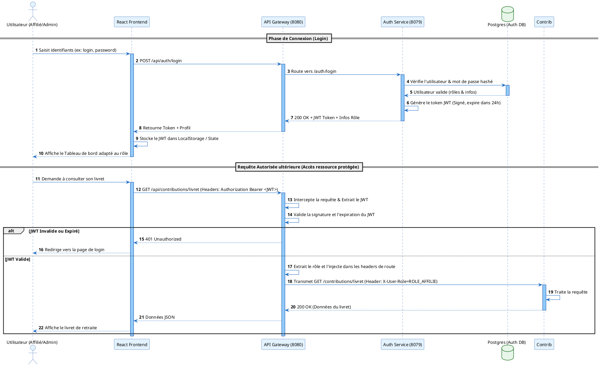
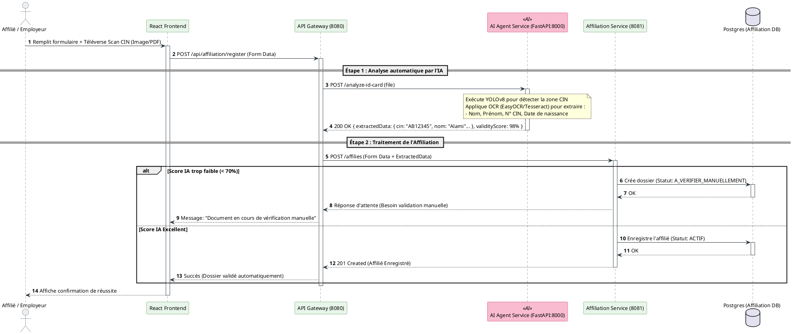
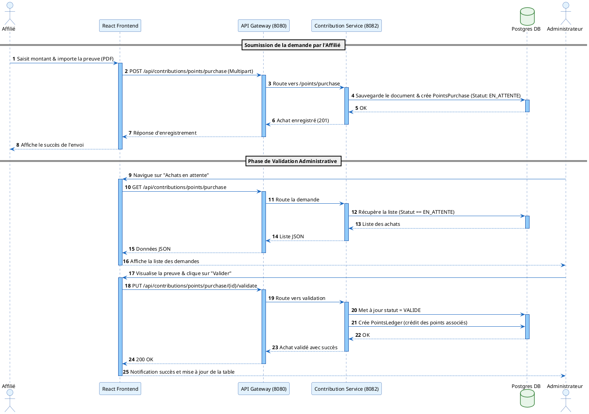
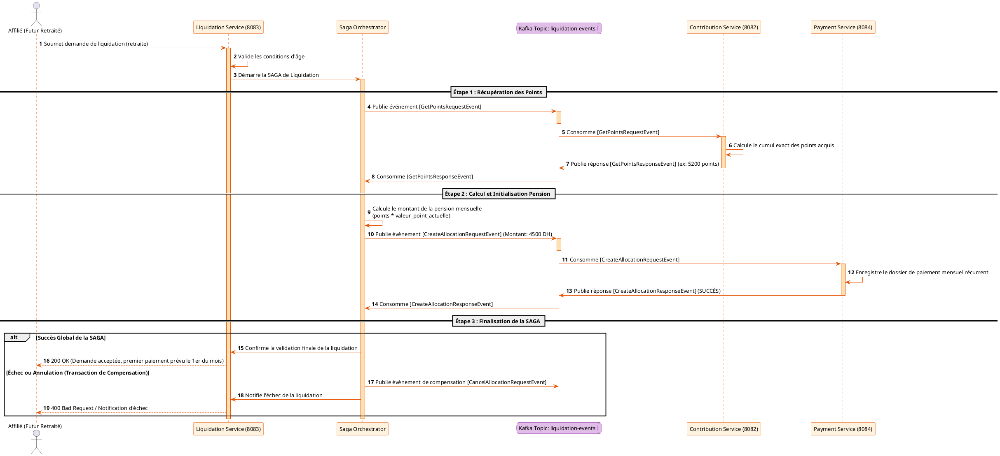
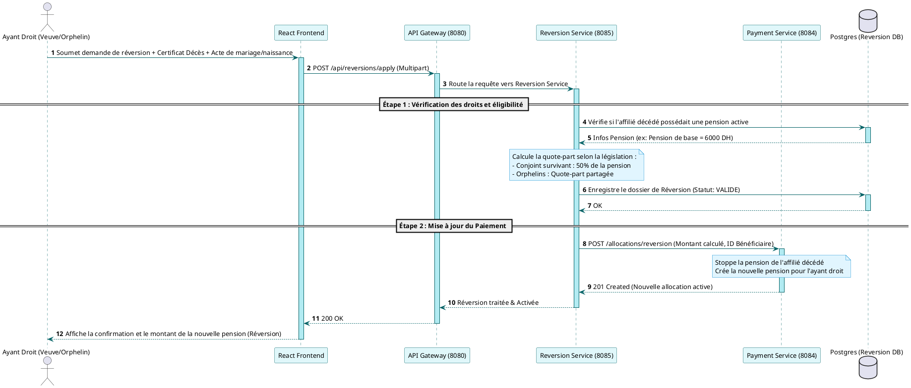
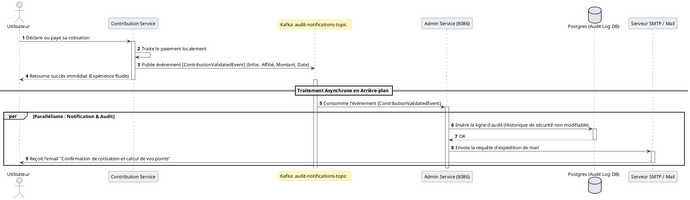

# Codes PlantUML des 6 Diagrammes de Séquence Clés — Projet CIMR

Ce document regroupe les codes PlantUML complets pour documenter l'architecture microservices de votre projet CIMR. 

---

## 1. Authentification & Routage Gateway (Sécurité JWT)

Ce diagramme montre comment un utilisateur obtient son jeton JWT auprès d' `auth-service` et l'utilise pour accéder aux endpoints protégés via `api-gateway`.

---

## 2. Affiliation & Analyse OCR de la CIN par l'IA (YOLOv8 & FastAPI)

Ce diagramme illustre le flux d'analyse de la carte CIN marocaine via le service IA (FastAPI) lors du processus d'affiliation.

---

## 3. Achat de Points & Validation de Preuve

Ce diagramme décrit la soumission manuelle d'une preuve de paiement par l'affilié et sa validation par l'administrateur.

---

## 4. Orchestration SAGA pour la Liquidation de Pension (Kafka)

Ce diagramme illustre le traitement complexe d'une demande de départ en retraite en utilisant Kafka et un orchestrateur de transactions distribuées SAGA.

---

## 5. Réversion de Pension (Ayants Droit & Loi 64-12)

Ce diagramme représente la demande de transfert de pension suite au décès de l'affilié vers son conjoint survivant ou ses orphelins.

---

## 6. Flux de Notification et de Logs d'Audit Asynchrones (Kafka)

Ce diagramme explique comment le système trace les activités sensibles et notifie les utilisateurs en arrière-plan sans bloquer les requêtes principales.

